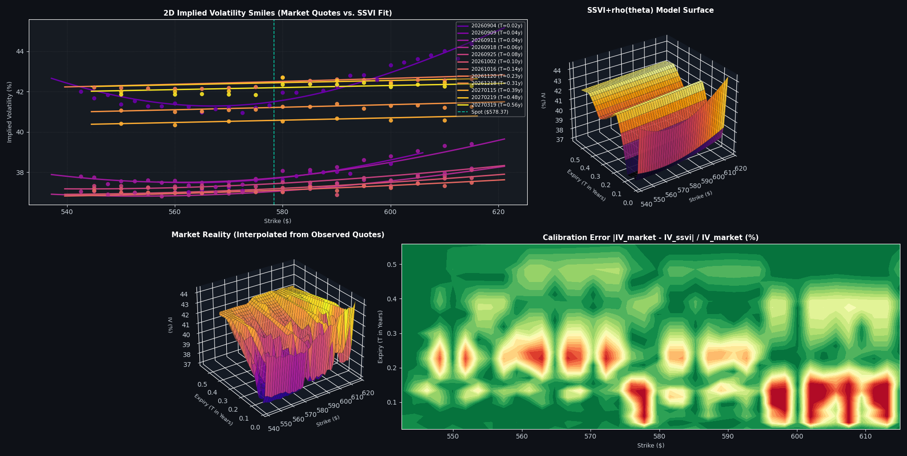

# QuantLab SSVI Volatility Radar

Real-time options volatility surface calibration and visualization via Interactive Brokers. Streams live option quotes, fits a global arbitrage-free SSVI+ρ(θ) surface, and displays market reality vs. model fit.

---

## Overview

```
Quote stream → Spread filter → SSVI+ρ(θ) calibration → 4-panel diagnostic visualization
```

Update cycle: ~100ms. All quotes, calibration, and visualization happen in-memory with no persistence.

---

## Architecture

```
main.py
  └── trading_bot.py
        ├── subscription_manager.py       [deduplicates market-data streams]
        ├── portfolio_manager.py          [account balance tracking]
        ├── volatility_manager.py         [coordinates SSVI pipeline]
        │   ├── chain_selector.py         [8–10 expirations × 6–8 OTM strikes]
        │   ├── radar_engine.py           [SSVI calibration + IV computation]
        │   └── volatility_visualizer.py  [4-panel display]
        ├── terminal_ui.py                [console output]
        └── options_pricer.py             [stateless BS + SSVI math]
```

### Key Design Decisions

**Reference-Counted Subscriptions**

Each contract is subscribed to once. When all owners release, the subscription cancels with IBKR. Keeps total < 100 simultaneous lines (IBKR limit).

**OTM-Only Subscriptions**

Per strike, subscribe to one leg only (calls ≥ spot, puts < spot). Avoids redundancy while maintaining deep liquidity for smile calibration.

**Stateless Pricing**

`options_pricer.py` has no state. Every function receives inputs, returns outputs. Safe for concurrent calls, easy to test.

**Spread Filter**

Quotes with spread > 15% excluded from calibration. Tunable in `radar_engine.py::_SPREAD_THRESHOLD_PCT`.

**Monotonic Theta**

Each expiry's ATM variance θ(t) anchored independently from 3 nearest-to-spot strikes. Post-processed to be monotonically increasing in t to prevent accidental calendar arbitrage in the input.

---

## Installation

### Prerequisites

- Python 3.8+
- TWS or IB Gateway running locally (port 7497 for paper, 4002 for live)
- Live market data subscriptions (US Equities + US Options)

### Setup

```bash
pip install -r requirements.txt
```

Edit `main.py`:
```python
bot = TradingBot(
    host="127.0.0.1",
    port=7497,
    client_id=20,
    symbol="NVDA",
    risk_free_rate=0.043,
    div_yield=0.0,
)
bot.start()
```

Run:
```bash
python main.py
tail -f quantlab_debug.log  # in another terminal
```

---

## Visualization

Four synchronized panels, updated every ~100ms:

1. **2D Smiles:** Market quotes (dots) vs. SSVI fit (lines) per expiry
2. **SSVI Surface:** Model prediction across (strike, expiry) grid
3. **Market Surface:** Interpolated from observed quotes
4. **Error Heatmap:** |IV_market - IV_ssvi| / IV_market (%)

Blue/green in heatmap = fit < 2% error. Red zones = investigate (usually deep OTM or earnings-week).

---


## Technical Details

### SSVI+ρ(θ) Formulation

```
w(k, θ) = (θ / 2) · [1 + ρ(θ)·φ(θ)·k + √((φ(θ)·k + ρ(θ))² + 1 - ρ(θ)²)]
```

**Variables:**
- k = ln(K/S): log-moneyness
- θ = σ²_ATM × T: ATM total variance (per expiry)
- w = IV² × T: total implied variance (output)

**Scale function:**
```
φ(θ) = η / (θ^γ · (1+θ)^(1-γ))
```

**Time-dependent correlation:**
```
ρ(θ) = ρ∞ + (ρ₀ - ρ∞) · exp(-λ · θ)
```

**Parameters to calibrate:** ρ₀, ρ∞, λ, η, γ (5 total, global across all expirations)

### Calibration

1. Extract market data: valid quotes (spread < 15%), solve IV via bisection on BS price
2. Anchor θ per expiry: average IV of 3 nearest-to-spot strikes
3. Enforce θ(t) monotonically increasing
4. Multi-start L-BFGS-B: minimize weighted sum of squared errors

Objective:
```
L = Σᵢ (1 / θᵢ) · [w_obs[i] - w_model(kᵢ, θᵢ)]²
```

Weight by 1/θ to prevent large-θ points from dominating optimization.

### No-Arbitrage

**Butterfly constraint (within slice):**
```
η · (1 + |ρ(θ)|) ≤ 2.0
```

**Calendar constraint:**
θ(t) monotonically increasing (enforced in data processing).

Both are checked during optimization; violations cause rejects.

---

## Terminal Output

```
[ ASSET TRACKER: NVDA ]
 CURRENT: $565.21 (+2.34%)   |   OPEN: $552.18
 ACTIVE SUBSCRIPTIONS: 64/100

 [ OPTION RADAR | EXPIRY: 20260904 ]
Strike | Call Bid | Call Ask | Call IV | SSVI IV | Put IV | Put Bid | OBI
-------|----------|---------|---------|---------|--------|--------|-----
560.0  | 10.20    | 10.45   | 32.1%   | 31.8%   | 31.2%  | 10.05  | +0.15
565.0  | 6.85     | 7.05    | 29.4%   | 29.3%   | 29.8%  | 6.90   | -0.18
```

**"SSVI IV"** is the model's prediction. If market IV >> SSVI IV, that strike is rich. If << SSVI IV, cheap.

---

## Limitations

1. **Flat risk-free rate:** No yield curve interpolation. Error ~1–2 bps for short-dated options.
2. **Continuous dividend yield:** Manually configured. Update quarterly or integrate corporate events API.
3. **Black-Scholes for American options:** Approximation, acceptable for IV trading. Underprices puts (1–5% ATM).
4. **Bid-ask data only:** No tick-level order flow; mid-price used for IV inversion.
5. **Market hours only:** Real-time data 9:30 AM–4:00 PM ET.

---

## Future Work

- **Dynamic r(T):** Interpolate risk-free curve from US Treasuries instead of flat rate
- **Automated dividend fetching:** Query IBKR corporate events API for upcoming yields
- **Historical logging:** Persist (strike, IV, SSVI_IV, timestamp) to SQLite for backtesting

---

## References

- Gatheral, J., & Jacquier, A. (2014). "Arbitrage-free SVI volatility surfaces." *Quantitative Finance*, 14(1).
- Gatheral, J. (2006). *The Volatility Surface: A Practitioner's Guide.* Wiley.
- Black, F., & Scholes, M. (1973). "The pricing of options and corporate liabilities." *Journal of Political Economy*, 81(3).

---

## License

MIT. No warranty. Use at your own risk.
